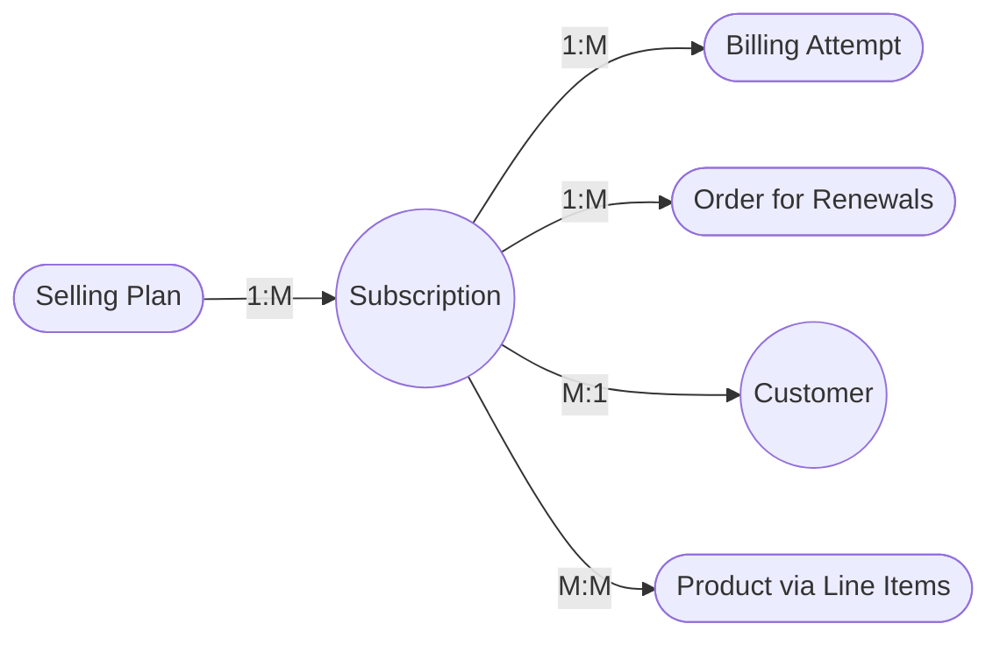

# Loop Subscriptions Data Model

## Core Objects

### Subscription (Contract)
- **Concept:** Represents the core binding agreement for continuous billing and product shipments.
- **Fields (Inferred):** `id`, `status`, `nextOrderDate`, `customer`, `lineItems`, `interval`, `createdAt`, `updatedAt`, `billingPolicy`, `deliveryPolicy`.
- **Relationship:** Direct 1:1 conceptual mapping to a `Shopify SubscriptionContract`. While Loop holds its native meta-information (e.g., custom discount configurations or streaks/rewards logs), the underlying transactional billing anchor must map synchronously to a Shopify native contract ID in standard integrations.

### Selling Plan
- **Concept:** Configuration defining *how* an item is sold on subscription (Intervals, discount structures, minimum commitments).
- **Fields (Inferred):** `id`, `name`, `billingPolicy`, `deliveryPolicy`, `pricingPolicies`.
- **Relationship:** Strictly mimics the `Shopify SellingPlanGroup` native structural concept introduced in Shopify's unified checkout models.

### Billing Policy
- **Concept:** Embedded within the selling plan; governs when the customer is charged.
- **Fields:** `interval` (e.g., DAY, WEEK, MONTH, CUSTOM), `intervalCount`, `anchorDate` (optional specific days of month for billing alignment).

### Delivery Policy
- **Concept:** Embedded within the selling plan; governs delivery cycles independently of billing.
- **Fields:** Similar interval mapping to Billing Policy but allows for prepayment structures (e.g., bill annually, deliver monthly).

### Billing Attempt
- **Concept:** Every individual iteration a charge is processed against a customer's vaulted payment identity.
- **Fields (Inferred):** `id`, `subscriptionId`, `amount`, `status` (PENDING, SUCCESS, FAILED), `errorMessage`, `attemptCount`, `createdAt`.
- **Relationship:** Highly essential to the Loop `Retain` processes, initiating Dunning sequences directly based on `FAILED` responses.

### Customer
- **Concept:** The subscriber entity.
- **How Loop Identifies Customers:** Since Loop forces native Shopify checkout, Loop customers strictly associate via generating session tokens keyed directly against the `Shopify Customer ID`. (External non-Shopify subscriptions are strictly undocumented and explicitly unsupported).

### Order
- **Concept:** Individual shipment generation.
- **How Loop creates Shopify Orders:** Loop communicates securely with Shopify's Contract APIs to trigger renewal checkouts, converting successful billing logic into finalized Shopify Orders tagged usually with app-specific "Loop" flags. The generated `Shopify Order ID` is the source of truth for shipment.

## Object Relationships



## Key IDs and Cross-References

| Loop ID | Shopify Equivalent | Description |
|---------|-------------------|-------------|
| *Loop Subscription ID* | *Shopify SubscriptionContract ID* | Primary identifier. (*Needs API exploration*: Does Loop decouple their IDs natively from Shopify API ids?) |
| *Loop Selling Plan ID* | *Shopify SellingPlan ID* | Standard alignment enforcing correct checkout logic. |
| *Loop Customer ID* | *Shopify Customer ID* | Loop primarily acts as a secondary UI/UX and management layer wrapping the native Shopify ID. |
| *Loop Order ID* | *Shopify Order ID* | Every successful billing attempt maps natively back to standard Shopify Order fulfillment ID logic. |

## Shopify Native Integration
- **Dependency:** Loop leverages **Shopify's native subscription APIs** natively. They are explicitly built for the Shopify framework and utilizing them independently outside of Shopify is officially unsupported.
- **Data Management:** Loop acts heavily as an advanced manipulation layer atop the Shopify logic. While Shopify securely houses vaulted cards, addresses, and initial creation contracts, Loop independently maintains deep states for Gamification (Rewards/Streaks/Mystery Gifts), complex gamified UI portal swaps, up-sells, dynamic shipping cost logic overrides, and explicit custom dunning (Retain) pathways.
- **Webhook Ramifications:** ThermoSlim will receive robust and rapid triggers from Loop for custom logic (e.g. `subscription.updated`) reflecting internal gamification or workflow automations, while raw financial billing captures will securely sync downstream against standard Shopify Order logic.

---

## ThermoSlim Deduplication & Mapping Strategy

### The Core Problem

Loop subscription rebill orders are **native Shopify orders**. This means they already exist in ThermoSlim's `orders` table (synced via the Shopify adapter with `source = 'SHOPIFY'` or `'MERGED'`). When we integrate Loop, we must **enrich** these existing rows — not create duplicates.

### Where Loop Data Currently Lives in ThermoSlim

| Loop Data | Current State in ThermoSlim | Gap |
|-----------|----------------------------|-----|
| Rebill orders (successful payments) | ✅ Already in `orders` table as Shopify orders | No Loop subscription ID attached |
| Subscription contracts (ACTIVE/PAUSED/CANCELLED) | ❌ Not present — `Subscription` table is CC-only today | Need full Loop sync |
| Subscription events (cancellations, pauses, billing failures) | ❌ Not present | Need webhook intake |
| Customer subscription linkage | ⚠️ Partial — customer exists but no `subscriptions` relation | Need to create `Subscription` rows |

### Identifying Loop Orders in Existing Data

Loop-originated Shopify orders can be tentatively identified today via:
- `orders.tags` containing `"Subscription"` or `"Recurring"`
- Line items with a `sellingPlanId` (Shopify-native selling plan reference)

However, these heuristics are unreliable without the Loop subscription ID attached. The authoritative cross-reference is:

```
GET /orders/shopify/{shopifyOrderId}  →  returns loopSubscriptionId
```

### Enrichment Flow (Initial Backfill)

```
1. Pull all Loop subscriptions via GET /subscriptions
2. For each subscription, pull order history via GET /subscriptions/{id}/orders/history
3. Match each Loop order's Shopify order ID against orders.shopifyOrderId
4. Create Subscription row in ThermoSlim, linked to originalOrderId (first Shopify order)
5. Update matched Order rows: tag with loopSubscriptionId (stored in orders.funnelReferenceId
   or a new field — TBD in integration spec)
6. Create SubscriptionEvent rows from Loop activity log
```

### Ongoing Sync (Webhooks)

After backfill, webhooks maintain state:

| Loop Webhook | ThermoSlim Action |
|--------------|-------------------|
| `subscription.created` | INSERT into `Subscription` |
| `subscription.cancelled` | UPDATE `Subscription.status`, INSERT `SubscriptionEvent` |
| `subscription.paused` | UPDATE `Subscription.status`, INSERT `SubscriptionEvent` |
| `subscription.resumed` | UPDATE `Subscription.status`, INSERT `SubscriptionEvent` |
| `order.created` (rebill) | Shopify adapter already handles this — just enrich with `loopSubscriptionId` |
| `order.paymentFailed` | INSERT `SubscriptionEvent` with type `RECYCLE_BILLING` |

### Revenue Deduplication — No Change Needed

Because Loop orders flow through Shopify, they are already counted correctly under the existing revenue rule:
> Revenue = `Order.totalPrice` where `source IN ('SHOPIFY', 'MERGED')` and `status = 'COMPLETE'`

**No revenue double-counting risk from Loop.** The risk is only on the `Subscription` table — we must not create duplicate `Subscription` rows if both a Loop webhook and a historical backfill attempt to create the same contract.

**Dedup key:** `Subscription` rows should use `loopSubscriptionId` as a unique constraint (similar to how `ccPurchaseId` is used today for CC subscriptions).
