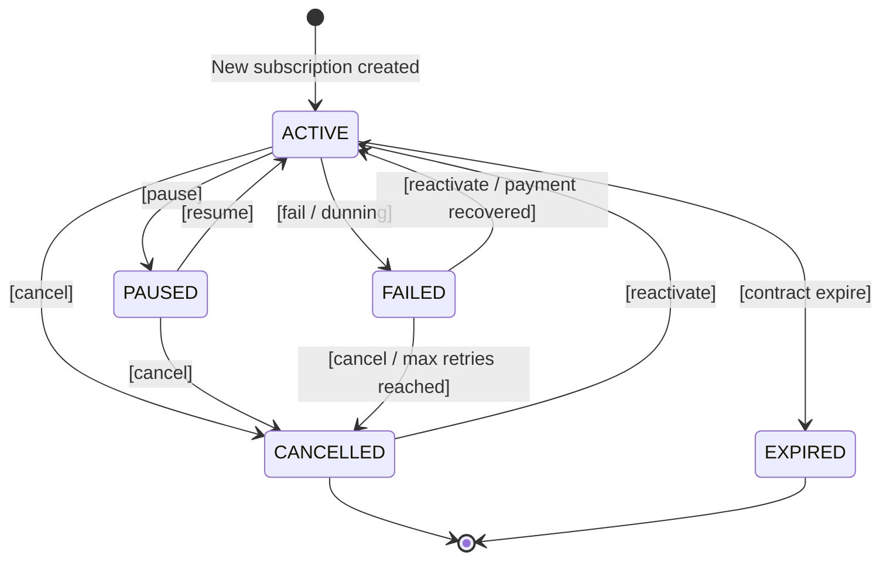

# Loop Subscription Lifecycle

## Status States

| Status | Description | Entry Conditions |
|--------|-------------|-----------------|
| `ACTIVE` | Currently active matching the billing frequency | Established from successful checkout, resumed from pause, or recovered from failed dunning state |
| `PAUSED` | Active, but specifically not permitted to renew/bill | Manually shifted by an internal store decision or customer action via portal |
| `CANCELLED` | Explicitly cancelled and halted | Triggered deeply by user explicit cancellation interfaces or support operations |
| `EXPIRED` | Automatically halted | Contract explicitly met its fixed end schedule limit |
| `FAILED` | Under active retain recovery limits | Billing cycle triggered but authorization was rejected |

## State Machine

## Transition Triggers

| From | To | Trigger | Who Can Trigger |
|------|----|---------|-----------------|
| — | `ACTIVE` | New subscription created via Native integrated checkout | Customer / System API |
| `ACTIVE` | `PAUSED` | Pause threshold activated | Customer, Merchant, Support API |
| `ACTIVE` | `CANCELLED` | Explicit cancellation button pressed or API hit | Customer, Merchant, Support API |
| `ACTIVE` | `FAILED` | Payment attempt fails with no secondary fallback | System (Payment Processor validation) |
| `PAUSED` | `ACTIVE` | Explicit un-pause executed | Customer, Merchant |
| `FAILED` | `ACTIVE` | Retain (Dunning) recovery successful sequence | System (Payment updated & charged) |
| `FAILED` | `CANCELLED` | Max Retain recovery thresholds exceeded explicitly | System automated Dunning expiration |
| `CANCELLED`| `ACTIVE` | Advanced Customer Portal reactivation (with specific new billing schedule anchors mapped) | Customer (via specialized reactivation workflows) |

## Payment Recovery Flow

Loop specifically heavily automates Payment Recovery workflows internally referencing its **Retain** configurations (`docs/integrations/loop-subscriptions/knowledge-base/09-retain`).
- **Dunning:** Automatically queues intelligent localized notification campaigns spanning intervals mapped by merchants. Retries card balances automatically checking expiration data.
- **Failures:** Webhooks broadcast `order.paymentFailed` heavily until the dunning campaign natively pushes the state into generic `CANCELLED` via exhaustion logic natively configured in Loop's rulesets.
- **Backup Payment:** Supports robust secondary methods explicitly added via `POST /subscriptions/change-payment-method-on-subscription` API.

## Cancellation Flow

In addition to base cancellations, Loop executes powerful Retain mechanics prior to allowing the final step over to `CANCELLED`:
- Presents mandatory / optional cancellation surveys defining why the `CANCELLED` intent was fired natively.
- Dynamically presents real-time win-back discounting or Gamification rewards.
- If skipped or declined, automatically issues `subscription.cancelled` payloads and syncs via Shopify Contract updates seamlessly ending future billing queues definitively.

## ThermoSlim Status Mapping

| Loop Status | → ThermoSlim SubscriptionStatus | Notes |
|-------------|----------------------------------|-------|
| `ACTIVE` | `ACTIVE` | Direct Map |
| `PAUSED` | `PAUSED` | Direct Map |
| `CANCELLED` | `CANCELLED` | Direct Map |
| `FAILED` | `RECYCLE_BILLING` / `RECYCLE_FAILED` | Determined natively: If actively inside Retain loop = `RECYCLE_BILLING`. Exhausted the Retain limits = native fallback into Loop's CANCELLED event mappings. |
| `EXPIRED` | `COMPLETE` | Matches exactly. Completed fixed interval queues correctly ends the SubscriptionStatus into COMPLETE mappings. |
| *Not native, but inferred* | `TRIAL` | Must securely intercept API attributes or order specifics to differentiate from standard ACTIVE |
