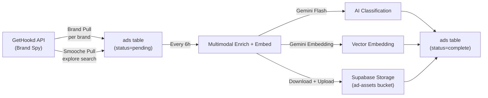

# Ad Intelligence System — Architecture Map

## Pipeline Overview

## Workflow Inventory

| Workflow | ID | Purpose | Trigger |
|---|---|---|---|
| **GetHookd — Brand Pull** | `tJQcvlYBRb6WAc3D` | Pull all ads for a specific brand (Brand Spy API) | Schedule + callable |
| **GetHookd — Smooche Full Pull** | `oV9nNUThsaKDKstw` | Pull ads from Explore search | Schedule |
| **Ads — Multimodal Enrich + Embed** | `kSzIsDnDrxa2JKgX` | AI enrichment pipeline | Every 6h + manual |

## Data Flow Detail

### Stage 1: Ingestion (Brand Pull / Smooche Pull)
- **Source**: GetHookd API (`/api/v1/brandspy/{id}` or `/api/v1/explore`)
- **Transform**: Code node extracts ad fields, brand info, media metadata
- **Destination**: `ads` table via PostgREST with `Prefer: resolution=merge-duplicates`
- **New ads land with `status = 'pending'`**

### Stage 2: Enrichment (Multimodal Enrich + Embed)
1. **Fetch**: `GET ads?status=eq.pending` (up to batch)
2. **Prepare Paths**: Detects video/image, builds storage path slug
3. **Download Thumbnail**: Fetches the thumbnail for Gemini analysis
4. **Multimodal Classify** (Gemini Flash): Analyzes thumbnail + ad text → returns:
   - `ad_type`, `funnel_stage`, `hook`, `core_angle`
   - `target_persona`, `pain_point`, `emotional_tone`
   - `visual_description`, `talent_description`, `color_palette`
   - `shot_style`, `on_screen_text`, `creative_brief`
   - `confidence` score
5. **Embed** (Gemini Embedding 2): Generates vector from brand + brief + visual description
6. **Download Main Asset**: Downloads full media file
7. **Upload to Storage**: Puts asset in `ad-assets` bucket
8. **Build Patch Body**: Consolidates enrichment + timestamps + asset URL
9. **Update Ad Row**: `PATCH ads?id=eq.{id}` → sets `status = 'complete'`

## Current Data State (as of now)

| Metric | Count |
|---|---|
| Total ads | 437 |
| With brand_external_id | 50 |
| With media fields | **0** (needs re-import fix) |
| With performance_score | Partial |

## Critical Dependency
The enrichment pipeline (`status=pending` → `status=complete`) **depends on `thumbnail_url` being populated** in Stage 1. Without it, the "Download Thumb" node has nothing to fetch, and Gemini can't classify.

> [!IMPORTANT]
> The Brand Pull Code node must extract `ad.media[0].thumbnail_url` for the enrichment pipeline to work. The updated JSON file has this fix but needs to be imported.
