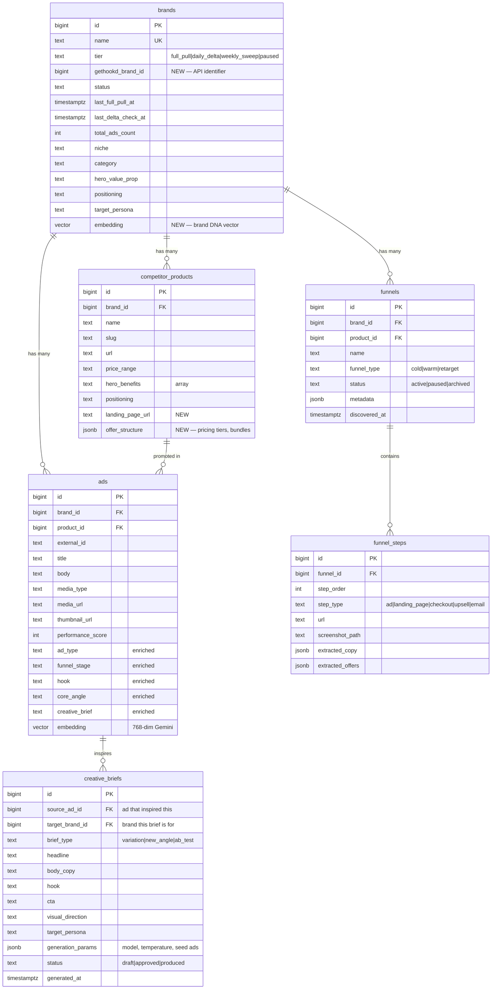

# Ad Intelligence Platform — Strategic Architecture

## Vision

Build a competitive intelligence engine that doesn't just **watch** competitor ads — it **learns** from them. Over time, the system accumulates enough structured data and embeddings to:

1. **Generate new ad concepts** modeled on proven performers
2. **Suggest A/B test variations** based on pattern analysis across thousands of ads
3. **Create advertising assets** (images, video scripts) using generative AI
4. **Reconstruct competitor funnels** (ad → landing page → offer → upsell)

Nobody else has this. Ad spy tools show you ads. This system **understands** them.

---

## Current State

| Table | Rows | Status |
|---|---|---|
| `ads` | 437 | Ingestion works, enrichment pipeline exists but 0 enriched |
| `brands` | 2 | Smooche, My Derma Dream — both `full_pull` tier |
| `competitor_products` | 0 | Schema exists, empty |
| Embeddings | 0 | Vector column exists, pipeline built, blocked on `thumbnail_url` |

**Immediate blocker**: Media fields (`thumbnail_url`, `media_url`, `media_type`) are all NULL. The enrichment pipeline depends on these. Fix = import the updated Brand Pull workflow JSON.

---

## Data Model (Current + Proposed)



---

## Phases

### Phase 1: Fix the Foundation (NOW)
> Get clean data flowing before building on top of it.

- [ ] Import fixed Brand Pull workflow (media field extraction)
- [ ] Add `gethookd_brand_id` column to `brands` table
- [ ] Wire Brand Pull to read from `brands` table instead of hardcoded ID
- [ ] Build daily delta trigger (pull only newest ads, stop when hitting known IDs)
- [ ] Run enrichment pipeline — get first batch of embeddings + AI classification

**Exit criteria**: 437 ads have `thumbnail_url`, `media_type`, `media_url` populated. At least 50 have embeddings.

### Phase 2: Product & Funnel Mapping
> Understand what they sell and how they sell it.

- [ ] Populate `competitor_products` — extract from ad landing pages
- [ ] Add `landing_page_url` and `offer_structure` to products
- [ ] Create `funnels` + `funnel_steps` tables
- [ ] Build a "Funnel Crawler" workflow: given an ad's landing page URL, crawl the checkout flow, capture screenshots, extract copy and offer structure
- [ ] Link ads → products (use Gemini to match ad content to product catalog)

**Exit criteria**: Each brand has products mapped, at least 2 funnels reconstructed with step-by-step screenshots.

### Phase 3: Intelligence Layer (Embeddings at Scale)
> Turn raw data into searchable competitive knowledge.

- [ ] Add brand-level embedding (aggregate of all ad embeddings = "brand DNA")
- [ ] Build similarity search: "find ads similar to X" via vector cosine distance
- [ ] Build pattern detection: cluster ads by hook type, angle, funnel stage
- [ ] Create performance correlation: which hooks/angles/formats have highest `performance_score`?
- [ ] Daily digest: "here's what changed in your competitors' ad strategy this week"

**Exit criteria**: Can query "show me all top-performing TOF video ads targeting women 35+ with pain-point hooks" and get ranked results.

### Phase 4: Generative Creative Engine
> Use the corpus to create, not just observe.

- [ ] **A/B Test Generator**: Given a winning ad, generate 3 variations (different hook, different CTA, different visual direction) using the `creative_briefs` table
- [ ] **Ad Copy Generator**: Feed winning patterns + brand voice + product info → generate new ad copy
- [ ] **Asset Generator**: Use image/video generation models (Flux, Runway, etc.) to create visual assets from creative briefs
- [ ] **Landing Page Generator**: Clone competitor page structure with your brand's copy and offers

**Exit criteria**: Can select a competitor ad, click "generate variation for ThermoSlim", and get a complete creative brief with generated assets.

### Phase 5: Closed-Loop Optimization
> Connect output back to performance data.

- [ ] Track which generated briefs were actually produced and run
- [ ] Connect to your own ad platform (Meta Ads API) to pull performance of YOUR ads
- [ ] Build feedback loop: generated ad → ran → performance data → re-rank the corpus
- [ ] The system learns which competitor patterns actually work for YOUR brand

---

## Schema Changes Needed Now

### Immediate (Phase 1)
```sql
-- Add GetHookd API brand ID to brands table
ALTER TABLE public.brands ADD COLUMN gethookd_brand_id bigint;

-- My Derma Dream = 138083 in GetHookd
UPDATE public.brands SET gethookd_brand_id = 138083 WHERE name = 'My Derma Dream';
```

### Phase 2
```sql
-- Extend competitor_products
ALTER TABLE public.competitor_products 
  ADD COLUMN landing_page_url text,
  ADD COLUMN offer_structure jsonb;

-- New tables for funnel reconstruction
CREATE TABLE public.funnels ( ... );
CREATE TABLE public.funnel_steps ( ... );
```

### Phase 4
```sql
CREATE TABLE public.creative_briefs ( ... );
```

---

## Key Architectural Decisions

1. **Embeddings are the moat.** Every ad gets a 768-dim Gemini embedding. Over time, this corpus becomes unsearchable by competitors — they'd need to rebuild the entire history.

2. **Products bridge ads to funnels.** An ad promotes a product. A product has a funnel. Without the product layer, you can't reconstruct the full conversion path.

3. **Brands table is the orchestrator.** It controls which brands get pulled, at what frequency, and tracks sync state. Every workflow reads from it.

4. **Creative briefs are the output.** The system doesn't just show you data — it generates actionable creative briefs that reference specific winning patterns from the corpus.
